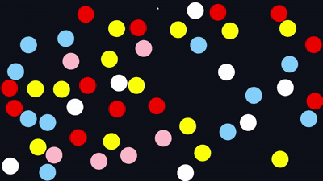

# OpenGL-Elastic-Collision-Simulator

I had been studying academically for a long time and was feeling burned out due to the pressure that comes with it.  
So I decided to disconnect by building a project in something I hadn’t studied academically — relying only on brain power, my previous knowledge, and my experience in computer science.

I made this project after watching only about 40 minutes of Victor Gordon's OpenGL Crash Course on FreeCodeCamp, and reading some basics about the physics behind elastic simulation,  
Equal-sized circles collide with each other and change color based on which one is faster — the faster one gives its color to the slower one, as shown in the GIF below.

  

Despite not having experience in computer graphics, I made sure to apply clean code principles, which helped me alot in the debugging even though I hadn’t worked in this domain before, it was smooth thanks to clean code.  

---

### Useful Resources:
1. [Victor Gordon - OpenGL Course](https://www.youtube.com/watch?v=45MIykWJ-C4&t=2423s)
2. [Fast Rendering Sphere Code extremely clever and worth checking out](https://www.youtube.com/watch?v=VEnglRKNHjU)
3. [Physical Collisions Well Explained](https://www.youtube.com/watch?v=dJNFPv9Mj-Y)
